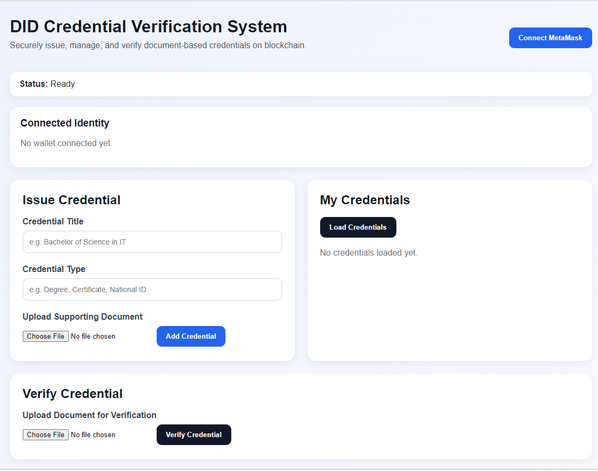
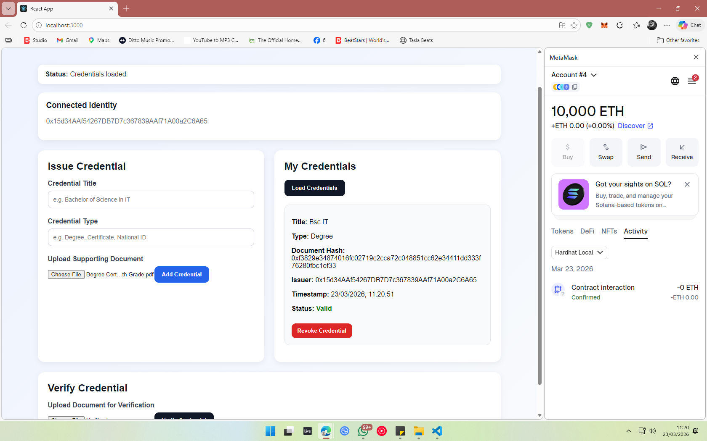
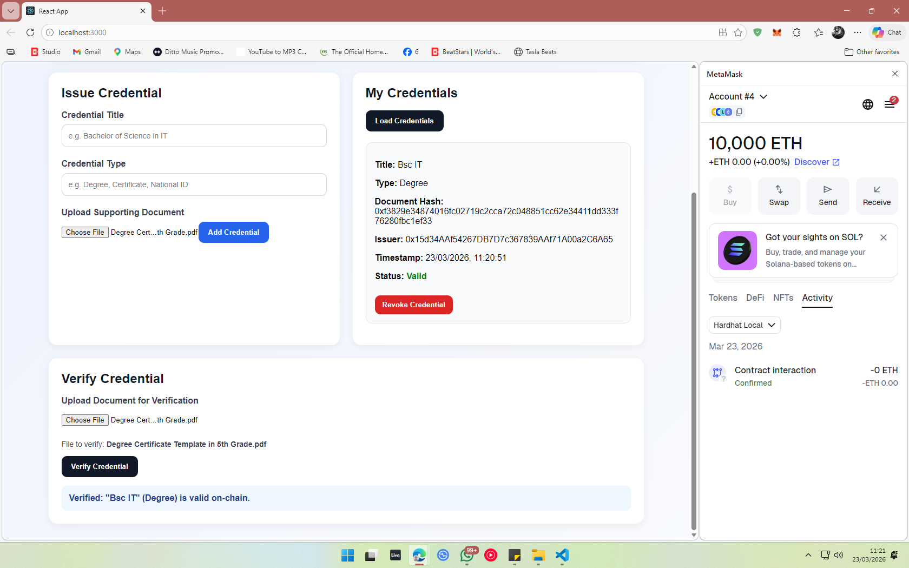

# Decentralized Identity (DID) Credential Verification DApp

A blockchain-based system that allows users to issue, manage, revoke, and verify credentials securely using smart contracts and cryptographic hashing.

---

##  Features

- Connect wallet with MetaMask  
- Issue credentials with document metadata  
- Hash uploaded documents in the browser  
- Store only document hashes on-chain  
- View issued credentials  
- Revoke credentials  
- Verify uploaded documents against on-chain records  

---

##  Key Concepts Demonstrated

- Decentralization  
- Smart Contracts  
- Cryptographic Hashing  
- Blockchain Immutability  
- Wallet-based Authentication  

---

##  Tech Stack

- Solidity  
- Hardhat  
- React.js  
- Ethers.js  
- MetaMask  

---

## 📁 Project Structure

- `contracts/` → Solidity smart contracts  
- `scripts/` → Deployment scripts  
- `frontend/` → React frontend  
- `hardhat.config.js` → Hardhat configuration  

---

##  Screenshots

### 🔹 Main Interface


### 🔹 Credential Added


### 🔹 Verification Success


---

##  How to Run Locally

### 1. Install backend dependencies
```bash
npm install